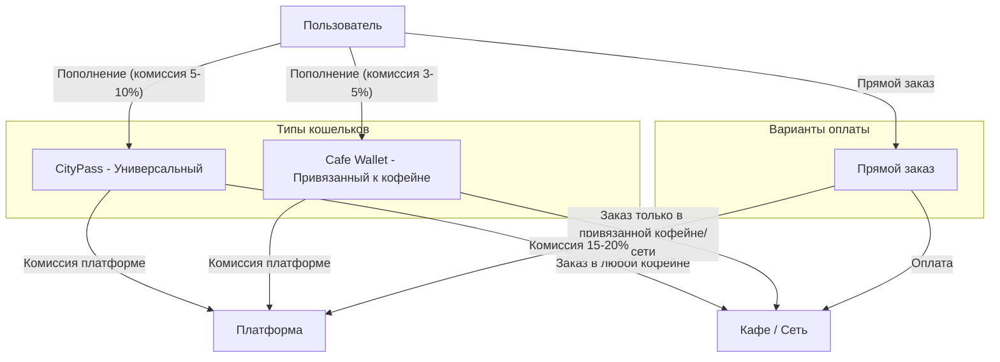

# Комплексный план развития SubscribeCoffie

## Текущее состояние проекта

**Реализовано:**

- Базовый функционал заказов (создание, статусы, QR-выдача)
- Базовая система кошельков (требует расширения до двух типов)
- Admin панель (управление кафе, меню, заказами, кошельками)
- Аналитика и dashboard
- Backend инфраструктура (Supabase + миграции)

**Стадия проекта: LOCAL MVP (без облака)**

- Локальный Supabase (Docker)
- Все платежи - **MOCK/тестовые** (готовим архитектуру, не интегрируем реальные платёжные системы)
- Фокус: UX, бизнес-логика, валидация концепции с первыми кофейнями
- Реальные платёжные агенты (Stripe/ЮKassa) - **после облачного деплоя и пилотного запуска**

**Планируется в MVP (mock версии):**

- Два типа кошельков (UI + DB структура + моделирование):
  - **CityPass** - универсальный для всех кофеен (комиссия 5-10%)
  - **Cafe Wallet** - привязанный к конкретной кофейне/сети (комиссия 3-5%)
- Прямая оплата картой без кошелька (комиссия 15-20%)
- **Вся логика комиссий, расчётов, транзакций работает корректно - но "оплата" симулируется**
- Подготовка интерфейсов для будущей интеграции платёжных агентов

**Технический долг:**

- Real-time обновления не полностью реализованы (файлы удалены из-за несовместимости SDK)
- Нет полноценной авторизации (только phone-based)
- Mock платежи (интеграция реальных - после облачного деплоя)

---

## Архитектура монетизации



**Модель кошельков:**

1. **CityPass (Универсальный кошелёк)**

   - Работает во всех подключенных кофейнях
   - Комиссия платформы: 5-10% при пополнении
   - Удобно для активных пользователей, посещающих разные места
   - Возможность получать кэшбек и бонусы за активность

2. **Cafe Wallet (Привязанный кошелёк)**

   - Привязан к конкретной кофейне или сети кофеен
   - Комиссия платформы: 3-5% при пополнении (ниже, т.к. лояльность)
   - Работает только в одной кофейне или сети
   - Кафе может предлагать свои бонусы и акции
   - Выгодно для постоянных клиентов одного места

3. **Прямой заказ (без кошелька)**

   - Оплата картой при каждом заказе
   - Комиссия платформы: 15-20% с суммы заказа
   - Для случайных пользователей

**Примеры использования:**

- **Сценарий 1: Активный пользователь**
  - Пользователь работает в центре города и посещает 5-7 разных кофеен в неделю
  - Решение: CityPass с балансом 3000₽
  - Преимущество: один кошелёк для всех, удобно

- **Сценарий 2: Постоянный клиент одной кофейни**
  - Пользователь живёт рядом с любимой кофейней, покупает кофе каждое утро
  - Решение: Cafe Wallet для этой кофейни с балансом 2000₽
  - Преимущество: ниже комиссия (3-5% вместо 5-10%), возможные акции от кафе

- **Сценарий 3: Любитель сети кофеен**
  - Пользователь предпочитает сеть "Coffeeshop Company" (10 точек в городе)
  - Решение: Cafe Wallet для сети "Coffeeshop Company"
  - Преимущество: работает во всех точках сети, ниже комиссия, бонусы от сети

- **Сценарий 4: Случайный клиент**
  - Турист или редкий посетитель кофеен
  - Решение: Прямая оплата картой
  - Преимущество: не нужно пополнять кошелёк

**Реализация сетей кофеен:**

- Таблица `wallet_networks`:
  - `id`, `name` (например, "Starbucks", "Coffeeshop Company")
  - `owner_user_id` (владелец сети)
  - `commission_rate` (индивидуальная ставка комиссии для сети)

- Таблица `cafe_network_members`:
  - `network_id`, `cafe_id`
  - Связывает кафе с сетью

- Логика валидации при оплате:
  ```sql
  -- Если wallet_type = 'cafe_wallet':
  --   Если wallet.cafe_id = order.cafe_id → ✅ Разрешено
  --   Если wallet.network_id IS NOT NULL AND order.cafe_id IN (SELECT cafe_id FROM cafe_network_members WHERE network_id = wallet.network_id) → ✅ Разрешено
  --   Иначе → ❌ "Этот кошелёк привязан к другой кофейне"
  -- Если wallet_type = 'citypass' → ✅ Разрешено всегда
  ```


---

## ФАЗА 1: MVP / Запуск (1-2 месяца)

### 1.1 Mock-платежи + Два типа кошельков (P0 - Critical)

**Цель:** Подготовить архитектуру для будущей интеграции платежей, но пока работать с тестовыми данными и симуляцией.

**Backend:**

- Создать миграцию `20260201_wallet_types_mock_payments.sql`:
  - Таблица `payment_methods` (хранит данные карт, но пока mock):
    - `id`, `user_id`, `card_last4` TEXT, `card_brand` TEXT, `is_default` BOOLEAN
    - `payment_provider` TEXT ('mock' для MVP, потом 'stripe' / 'yookassa')
    - `provider_token` TEXT (пока пустой, потом реальный токен)
  - Таблица `payment_transactions` (история всех транзакций, реальная логика):
    - `id`, `user_id`, `wallet_id`, `order_id`, `amount_credits`, `commission_credits`
    - `transaction_type` TEXT ('topup', 'order_payment', 'refund')
    - `payment_method_id`, `status` TEXT ('pending', 'completed', 'failed')
    - `provider_transaction_id` TEXT (пока mock UUID)
    - `created_at`, `completed_at`
  - Таблица `commission_config` (настройка комиссий):
    - `id`, `operation_type` TEXT ('citypass_topup', 'cafe_wallet_topup', 'direct_order')
    - `commission_percent` DECIMAL, `active` BOOLEAN
  - **Обновить таблицу `wallets`:**
    - Добавить поле `wallet_type` ENUM('citypass', 'cafe_wallet')
    - Добавить поле `cafe_id` UUID (nullable) - для cafe_wallet привязка к кофейне
    - Добавить поле `network_id` UUID (nullable) - для cafe_wallet привязка к сети
  - Таблица `wallet_networks` (сети кофеен):
    - `id`, `name`, `owner_user_id`, `commission_rate`, `created_at`, `updated_at`
  - Таблица `cafe_network_members`:
    - `network_id`, `cafe_id`, `joined_at`, PRIMARY KEY (network_id, cafe_id)
  - **RPC функции (с mock логикой):**
    - `create_citypass_wallet(user_id)` - создать универсальный кошелёк
    - `create_cafe_wallet(user_id, cafe_id, network_id)` - создать привязанный кошелёк
    - `mock_wallet_topup(wallet_id, amount, payment_method_id)` - **симуляция пополнения:**
      - Рассчитать комиссию по типу кошелька
      - Создать транзакцию со статусом 'completed'
      - Увеличить баланс кошелька
      - Вернуть `{ success: true, transaction_id, amount_credited, commission }`
    - `mock_direct_order_payment(order_id, amount, payment_method_id)` - **симуляция прямой оплаты:**
      - Рассчитать комиссию 15-20%
      - Создать транзакцию
      - Обновить статус заказа на 'paid'
    - `calculate_commission(amount, operation_type, wallet_type)` - точный расчёт комиссии
    - `validate_wallet_for_order(wallet_id, cafe_id)` - проверка допустимости оплаты
    - `get_user_wallets(user_id)` - список всех кошельков

**Admin Panel:**

- Страница `/admin/payments` - мониторинг всех mock транзакций
- Страница `/admin/commission-settings` - настройка ставок комиссий
- Страница `/admin/wallet-networks` - управление сетями (если реализуем 1.6)
- Dashboard виджет "Revenue (Mock)" - показывает симулированную выручку
- **Badge "DEMO MODE"** на всех страницах платежей

**iOS App:**

- **БЕЗ интеграции Stripe/ЮKassa SDK** (пока не нужно)
- **Новый view `PaymentMethodsView.swift`** - управление картами (mock):
  - Форма "Добавить карту" с валидацией номера (UI only)
  - При сохранении: создаёт запись в `payment_methods` с `provider='mock'`
  - Список карт с badge "DEMO"
- **Новый view `WalletSelectionView.swift`:**
  - Выбор типа кошелька: "Создать CityPass" / "Создать Cafe Wallet"
  - Список всех кошельков пользователя с балансами
  - Иконки и цвета для разных типов
- **Обновить `WalletTopUpView.swift`:**
  - Mock "оплата" (вызов `mock_wallet_topup`)
  - Индикатор комиссии: "Пополнить на 1000₽ (комиссия 50₽, зачислится 950₽)"
  - Анимация успеха: "Пополнено! (тестовый режим)"
  - Badge "DEMO" на кнопке "Оплатить"
- **Обновить `CheckoutView.swift`:**
  - Выбор способа оплаты: CityPass / Cafe Wallet / Прямая оплата (mock карта)
  - Фильтрация кошельков: cafe_wallet только для своей кофейни/сети
  - Показать комиссию для каждого варианта
  - При оплате: вызов `mock_direct_order_payment` или списание с кошелька
- **Обновить `CafeView.swift`:**
  - Кнопка "Создать кошелёк для [Название]" если нет cafe_wallet
  - Badge "Ваш кошелёк здесь" если есть
- Раздел в профиле "Мои кошельки" с балансами и типами

**Подготовка к будущей интеграции:**

- Все RPC функции имеют параметр `payment_method_id` - готовы к реальным токенам
- Таблица `payment_methods` готова хранить реальные токены от Stripe/ЮKassa
- В будущем: заменить `mock_wallet_topup` → `process_wallet_topup` с вызовом Stripe API
- В будущем: добавить webhook endpoints для обработки callback от платёжных систем

**Файлы для изменения:**

- [SubscribeCoffieBackend/supabase/migrations/20260201_wallet_types_mock_payments.sql](SubscribeCoffieBackend/supabase/migrations/)
- [subscribecoffie-admin/app/admin/payments/](subscribecoffie-admin/app/admin/payments/)
- [subscribecoffie-admin/app/admin/commission-settings/](subscribecoffie-admin/app/admin/commission-settings/)
- [SubscribeCoffieClean/.../Views/WalletTopUpView.swift](SubscribeCoffieClean/SubscribeCoffieClean/SubscribeCoffieClean/Views/WalletTopUpView.swift)
- [SubscribeCoffieClean/.../Views/CheckoutView.swift](SubscribeCoffieClean/SubscribeCoffieClean/SubscribeCoffieClean/Views/CheckoutView.swift)
- [SubscribeCoffieClean/.../Views/CafeView.swift](SubscribeCoffieClean/SubscribeCoffieClean/SubscribeCoffieClean/Views/CafeView.swift)
- Новый файл `WalletSelectionView.swift`
- Новый файл `PaymentMethodsView.swift`

---

### 1.2 Онбординг кафе (P0 - Critical)

**Backend:**

- Таблица `cafe_onboarding_requests` (заявки на подключение)
- Таблица `cafe_documents` (документы, логотипы, фото меню)
- RPC `submit_cafe_application(name, address, phone, email, description, documents)`
- RPC `approve_cafe(request_id, admin_user_id)` - создаёт кафе + владельца

**Admin Panel:**

- Страница `/admin/onboarding` - список заявок
- Страница `/admin/onboarding/[id]` - детали заявки с документами
- Форма одобрения/отклонения с комментариями
- Email уведомления владельцу при одобрении

**iOS App (опционально для владельцев):**

- Экран "Хотите подключить своё кафе?" с формой заявки
- Или веб-форма на лендинге

**Файлы:**

- [SubscribeCoffieBackend/supabase/migrations/20260202_cafe_onboarding.sql](SubscribeCoffieBackend/supabase/migrations/)
- [subscribecoffie-admin/app/admin/onboarding/](subscribecoffie-admin/app/admin/onboarding/)

---

### 1.3 Полноценная авторизация (P1)

**Backend:**

- Использовать Supabase Auth вместо phone-only
- Добавить OAuth провайдеры (Google, Apple Sign In)
- Email + password fallback
- Миграция `20260203_auth_enhancement.sql`:
  - Таблица `user_profiles` (расширенная информация о пользователях)
  - Связать с `auth.users`

**iOS App:**

- Обновить `LoginView.swift` - добавить кнопки "Sign in with Apple", "Sign in with Google"
- Интеграция `AuthenticationServices` (Sign in with Apple)
- Хранение токенов в Keychain

**Файлы:**

- [SubscribeCoffieClean/.../Views/LoginView.swift](SubscribeCoffieClean/SubscribeCoffieClean/SubscribeCoffieClean/Views/LoginView.swift)
- [SubscribeCoffieBackend/supabase/migrations/20260203_auth_enhancement.sql](SubscribeCoffieBackend/supabase/migrations/)

---

### 1.4 Улучшение UX заказов (P1)

**iOS App:**

- Добавить индикатор прогресса заказа (timeline с анимацией)
- Push-уведомления о статусе заказа (требует реализации push infrastructure)
- Улучшить `OrderStatusView.swift` - более наглядная визуализация
- Добавить возможность повторить предыдущий заказ
- История заказов с фильтрами и поиском

**Backend:**

- RPC `get_user_order_history(user_id, limit, offset)` с пагинацией
- RPC `reorder(original_order_id)` - создаёт копию заказа

**Файлы:**

- [SubscribeCoffieClean/.../Views/OrderStatusView.swift](SubscribeCoffieClean/SubscribeCoffieClean/SubscribeCoffieClean/Views/OrderStatusView.swift)
- Новый файл `OrderHistoryView.swift`
- [SubscribeCoffieBackend/supabase/migrations/20260204_order_history_rpc.sql](SubscribeCoffieBackend/supabase/migrations/)

---

### 1.5 Базовая аналитика для кафе (P2)

**Admin Panel:**

- Обновить `/admin/dashboard` для владельцев кафе (фильтр по их кафе)
- Добавить графики выручки (Chart.js или Recharts)
- Топ-продаваемые позиции меню
- Пиковые часы заказов
- Средний чек и конверсия

**Backend:**

- Использовать существующие views `cafe_analytics`, `popular_menu_items`
- Добавить RPC `get_hourly_orders_stats(cafe_id, date_from, date_to)`

**Файлы:**

- [subscribecoffie-admin/app/admin/dashboard/page.tsx](subscribecoffie-admin/app/admin/dashboard/page.tsx)
- [SubscribeCoffieBackend/supabase/migrations/20260205_hourly_stats.sql](SubscribeCoffieBackend/supabase/migrations/)

---

### 1.6 Сети кофеен (P2)

**Концепция:** Владельцы могут объединять несколько кофеен в сеть. Пользователи с Cafe Wallet для сети могут использовать его во всех точках этой сети.

**Backend:**

- Миграция `20260206_cafe_networks.sql` (уже включена в 20260201_payment_integration.sql, но можно вынести отдельно):
  - Таблицы `wallet_networks`, `cafe_network_members` уже созданы
  - RPC `create_network(name, owner_user_id, commission_rate)` - создать сеть
  - RPC `add_cafe_to_network(network_id, cafe_id)` - добавить кафе в сеть
  - RPC `remove_cafe_from_network(network_id, cafe_id)` - удалить кафе из сети
  - RPC `get_network_cafes(network_id)` - список кафе в сети
  - RPC `get_cafe_network(cafe_id)` - определить, к какой сети принадлежит кафе

**Admin Panel:**

- Страница `/admin/networks` - список всех сетей
- Страница `/admin/networks/new` - создать новую сеть
- Страница `/admin/networks/[id]` - управление сетью:
  - Список кафе в сети
  - Добавить/удалить кафе
  - Настройки комиссии для сети
  - Статистика по сети (суммарная выручка всех точек)
- Раздел в `/admin/cafes/[id]` - показать, к какой сети принадлежит кафе

**iOS App:**

- В `CafeView.swift`:
  - Если кафе входит в сеть, показать badge "Сеть [Название]"
  - Кнопка "Создать кошелёк для сети [Название]" (вместо кошелька для одной кофейни)
- В `WalletSelectionView.swift`:
  - При создании Cafe Wallet показать опцию: "Создать для этой кофейни" или "Создать для сети [Название]"
  - Список всех кошельков с указанием: "Cafe Wallet: [Название кафе]" или "Cafe Wallet: Сеть [Название] (5 точек)"
- В `CheckoutView.swift`:
  - При выборе кошелька показать: "Cafe Wallet для сети [Название] - работает в [X] кофейнях"

**Файлы:**

- [SubscribeCoffieBackend/supabase/migrations/20260206_cafe_networks.sql](SubscribeCoffieBackend/supabase/migrations/) (или включить в 20260201)
- [subscribecoffie-admin/app/admin/networks/](subscribecoffie-admin/app/admin/networks/) - новые страницы
- [SubscribeCoffieClean/.../Views/CafeView.swift](SubscribeCoffieClean/SubscribeCoffieClean/SubscribeCoffieClean/Views/CafeView.swift)
- [SubscribeCoffieClean/.../Views/WalletSelectionView.swift](SubscribeCoffieClean/SubscribeCoffieClean/SubscribeCoffieClean/Views/WalletSelectionView.swift)
- [SubscribeCoffieClean/.../Views/CheckoutView.swift](SubscribeCoffieClean/SubscribeCoffieClean/SubscribeCoffieClean/Views/CheckoutView.swift)

---

## ФАЗА 2: Рост (3-6 месяцев)

### 2.1 Программа лояльности и геймификация (P0)

**Backend:**

- Миграция `20260210_loyalty_program.sql`:
  - Таблица `loyalty_levels` (Bronze, Silver, Gold, Platinum)
  - Таблица `user_loyalty` (уровень пользователя, прогресс)
  - Таблица `achievements` (достижения: "Первый заказ", "10 заказов", "Исследователь кафе")
  - Таблица `user_achievements` (полученные достижения)
  - RPC `calculate_loyalty_points(user_id)` - на основе заказов
  - RPC `upgrade_loyalty_level(user_id)` - автоматический апгрейд
  - Триггер на `orders` - начисление поинтов после выдачи

**iOS App:**

- Новый раздел "Профиль" → "Моя программа лояльности"
- View `LoyaltyDashboardView.swift`:
  - Текущий уровень с прогресс-баром
  - Список достижений (unlocked / locked)
  - История начислений поинтов
- Badge на иконке профиля при получении нового достижения
- Анимация level-up с конфетти

**Admin Panel:**

- Страница `/admin/loyalty` - настройка уровней и наград
- Возможность создавать кастомные достижения

**Файлы:**

- [SubscribeCoffieBackend/supabase/migrations/20260210_loyalty_program.sql](SubscribeCoffieBackend/supabase/migrations/)
- Новый файл `LoyaltyDashboardView.swift`
- [subscribecoffie-admin/app/admin/loyalty/](subscribecoffie-admin/app/admin/loyalty/)

---

### 2.2 Маркетинговые инструменты (P0)

**Backend:**

- Миграция `20260211_marketing_tools.sql`:
  - Таблица `promo_codes` (коды, скидка, лимиты, срок действия)
  - Таблица `promo_usage` (кто использовал)
  - Таблица `campaigns` (маркетинговые кампании)
  - Таблица `push_campaigns` (массовые рассылки)
  - RPC `validate_promo_code(code, user_id, order_amount)`
  - RPC `apply_promo_code(order_id, promo_id)` - применяет скидку
  - RPC `send_push_campaign(campaign_id, user_segment)` - отправка уведомлений

**Admin Panel:**

- Страница `/admin/marketing/promo-codes` - создание промокодов
- Страница `/admin/marketing/campaigns` - создание кампаний
- Сегментация пользователей (новые / активные / спящие)
- A/B тестирование промо

**iOS App:**

- Поле "Промокод" в `CheckoutView.swift`
- Banner с актуальными акциями на главной
- Push-уведомления о новых акциях

**Файлы:**

- [SubscribeCoffieBackend/supabase/migrations/20260211_marketing_tools.sql](SubscribeCoffieBackend/supabase/migrations/)
- [subscribecoffie-admin/app/admin/marketing/](subscribecoffie-admin/app/admin/marketing/)
- [SubscribeCoffieClean/.../Views/CheckoutView.swift](SubscribeCoffieClean/SubscribeCoffieClean/SubscribeCoffieClean/Views/CheckoutView.swift)

---

### 2.3 Рекомендательная система (P1)

**Backend:**

- Миграция `20260212_recommendations.sql`:
  - Таблица `user_preferences` (любимые категории, кафе)
  - View `trending_items` (популярные позиции за последние 7 дней)
  - RPC `get_personalized_recommendations(user_id, limit)`:
    - На основе истории заказов
    - Collaborative filtering (что заказывают похожие пользователи)
    - Популярные новинки в любимых кафе
  - RPC `get_cafe_recommendations(user_id)` - предлагает новые кафе

**iOS App:**

- Секция "Рекомендуем" на главной (`MapSelectionView.swift`)
- Секция "Попробуйте что-то новое" в меню кафе (`CafeView.swift`)
- Персонализированные push: "В вашем любимом кафе новинка!"

**ML (опционально для будущего):**

- Python microservice с ML моделью (scikit-learn / TensorFlow Lite)
- Edge Function в Supabase для инференса

**Файлы:**

- [SubscribeCoffieBackend/supabase/migrations/20260212_recommendations.sql](SubscribeCoffieBackend/supabase/migrations/)
- [SubscribeCoffieClean/.../Views/MapSelectionView.swift](SubscribeCoffieClean/SubscribeCoffieClean/SubscribeCoffieClean/Views/MapSelectionView.swift)
- [SubscribeCoffieClean/.../Views/CafeView.swift](SubscribeCoffieClean/SubscribeCoffieClean/SubscribeCoffieClean/Views/CafeView.swift)

---

### 2.4 Социальные функции (P2)

**Backend:**

- Миграция `20260213_social_features.sql`:
  - Таблица `user_reviews` (отзывы на кафе и блюда)
  - Таблица `user_favorites` (избранные кафе и блюда)
  - Таблица `user_friends` (друзья в приложении)
  - Таблица `shared_orders` (групповые заказы)
  - RPC `submit_review(user_id, cafe_id, product_id, rating, comment)`
  - RPC `invite_friend_to_order(order_id, friend_user_id)` - split bill

**iOS App:**

- Возможность оставлять отзывы после получения заказа
- Избранное (сердечко на кафе и блюдах)
- Групповой заказ: "Пригласить друга" → split bill
- Профиль пользователя с отзывами и фото заказов (UGC)

**Файлы:**

- [SubscribeCoffieBackend/supabase/migrations/20260213_social_features.sql](SubscribeCoffieBackend/supabase/migrations/)
- Новые файлы: `ReviewView.swift`, `FavoritesView.swift`, `GroupOrderView.swift`

---

### 2.5 Real-time обновления (Технический долг)

**Backend:**

- Использовать Supabase Realtime Channels корректно
- Настроить broadcast для `orders` таблицы
- RPC `subscribe_to_order_updates(order_id)` - отдаёт channel name

**iOS App:**

- Реимплементация `RealtimeOrderService.swift` с совместимым API:
  - Использовать актуальную версию Supabase Swift SDK
  - Подписка на изменения конкретного заказа
  - Автоматическое обновление UI при смене статуса
- Реимплементация `ActiveOrdersView.swift`
- Добавить индикатор "Live" когда подключен к realtime

**Файлы:**

- Новый файл `RealtimeOrderService.swift` (совместимый)
- Новый файл `ActiveOrdersView.swift`
- [SubscribeCoffieBackend/supabase/migrations/20260214_realtime_config.sql](SubscribeCoffieBackend/supabase/migrations/)

---

## ФАЗА 3: Масштабирование (6-12 месяцев)

### 3.1 Мультирегиональность и франшиза (P0)

**Backend:**

- Миграция `20260220_multiregion.sql`:
  - Таблица `regions` (города, регионы)
  - Таблица `cafe_regions` (кафе → регион)
  - Таблица `delivery_zones` (зоны доставки)
  - Таблица `franchise_partners` (франчайзи)
  - RPC `get_cafes_in_region(region_id)`
  - RPC `calculate_delivery_fee(cafe_id, user_location)` - если добавим доставку

**Admin Panel:**

- Мультитенантность: разные dashboard для разных регионов
- Страница `/admin/regions` - управление регионами
- Страница `/admin/franchise` - управление франчайзи

**iOS App:**

- Автоопределение города пользователя (геолокация)
- Выбор города вручную
- Фильтр кафе по городу

**Файлы:**

- [SubscribeCoffieBackend/supabase/migrations/20260220_multiregion.sql](SubscribeCoffieBackend/supabase/migrations/)
- [subscribecoffie-admin/app/admin/regions/](subscribecoffie-admin/app/admin/regions/)
- Обновить `MapSelectionView.swift` с фильтром городов

---

### 3.2 B2B Dashboard для владельцев кафе (P0)

**Отдельное приложение или раздел Admin Panel:**

- Cafe Owner Dashboard (ограниченные права, видят только своё кафе)
- Детальная аналитика:
  - Выручка по дням/неделям/месяцам
  - Топ-продукты и аутсайдеры
  - Пиковые часы, средний чек
  - Конверсия (просмотры → заказы)
  - Customer retention (возвраты клиентов)
- Управление меню в реальном времени (убрать/добавить позиции)
- Управление стоп-листом
- Промо-кампании своего кафе
- Экспорт отчётов (PDF, Excel)

**Backend:**

- RPC `get_cafe_dashboard_metrics(cafe_id, period)` - агрегированные метрики
- RLS политики для cafe owners (видят только своё кафе)

**Файлы:**

- [subscribecoffie-admin/app/cafe-owner/](subscribecoffie-admin/app/cafe-owner/) - новый раздел
- [SubscribeCoffieBackend/supabase/migrations/20260221_cafe_owner_rls.sql](SubscribeCoffieBackend/supabase/migrations/)

---

### 3.3 Доставка и курьеры (Расширение бизнес-модели)

**Backend:**

- Миграция `20260222_delivery.sql`:
  - Таблица `couriers` (курьеры)
  - Таблица `delivery_orders` (заказы с доставкой)
  - Таблица `courier_locations` (геолокация курьеров)
  - RPC `assign_courier_to_order(order_id)` - автоматическое или ручное назначение
  - RPC `update_courier_location(courier_id, lat, lon)` - трекинг

**iOS App (для клиентов):**

- Опция "Доставка" при оформлении заказа
- Карта с местоположением курьера в реальном времени
- ETA доставки

**iOS App (для курьеров - отдельное):**

- Приложение для курьеров: список заказов, навигация, статусы
- Push-уведомления о новых заказах
- Чат с клиентом

**Файлы:**

- [SubscribeCoffieBackend/supabase/migrations/20260222_delivery.sql](SubscribeCoffieBackend/supabase/migrations/)
- Новый проект: `SubscribeCoffieCourier` (iOS app для курьеров)

---

### 3.4 Подписочная модель (Subscription)

**Backend:**

- Миграция `20260223_subscriptions.sql`:
  - Таблица `subscription_plans` (планы: Basic, Premium, VIP)
  - Таблица `user_subscriptions` (активные подписки)
  - Таблица `subscription_benefits` (льготы: бесплатная доставка, кэшбек)
  - RPC `subscribe_user(user_id, plan_id, payment_method_id)` - оформление подписки
  - RPC `check_subscription_benefits(user_id)` - проверка льгот при заказе
  - Cron job для автопродления и уведомлений

**Примеры планов:**

- Basic (₽299/мес): 5% кэшбек на все заказы
- Premium (₽599/мес): 10% кэшбек + бесплатная доставка
- VIP (₽1499/мес): 15% кэшбек + priority support + эксклюзивные акции

**iOS App:**

- Экран "Подписка" с описанием планов
- Оформление подписки через Apple In-App Purchase
- Badge "Premium" в профиле

**Файлы:**

- [SubscribeCoffieBackend/supabase/migrations/20260223_subscriptions.sql](SubscribeCoffieBackend/supabase/migrations/)
- Новый файл `SubscriptionPlansView.swift`

---

### 3.5 Расширенная аналитика и BI (P1)

**Backend:**

- Data Warehouse (PostgreSQL + Metabase / Apache Superset)
- ETL pipeline для агрегации данных
- Cohort analysis (когортный анализ пользователей)
- Funnel analysis (воронка конверсии)
- Churn prediction (предсказание оттока)

**Admin Panel:**

- Интеграция с Metabase: iframe с дашбордами
- Экспорт сырых данных для анализа

**Файлы:**

- [SubscribeCoffieBackend/analytics/](SubscribeCoffieBackend/analytics/) - новая папка для ETL скриптов
- [subscribecoffie-admin/app/admin/analytics/](subscribecoffie-admin/app/admin/analytics/)

---

### 3.6 Автоматизированное тестирование (Технический долг)

**Backend:**

- Расширить существующие SQL тесты в [SubscribeCoffieBackend/tests/](SubscribeCoffieBackend/tests/)
- Добавить integration tests для RPC функций
- CI/CD pipeline (GitHub Actions):
  - Запуск тестов при каждом PR
  - Автоматический deploy на staging

**Admin Panel:**

- E2E тесты с Playwright или Cypress
- Тесты критических флоу: создание кафе, создание заказа, управление меню

**iOS App:**

- XCTest UI tests для основных экранов
- Snapshot tests для UI компонентов
- CI/CD для iOS (Fastlane + GitHub Actions)

**Файлы:**

- [SubscribeCoffieBackend/.github/workflows/](SubscribeCoffieBackend/.github/workflows/) - CI config
- [subscribecoffie-admin/tests/](subscribecoffie-admin/tests/)
- [SubscribeCoffieClean/SubscribeCoffieCleanTests/](SubscribeCoffieClean/SubscribeCoffieCleanTests/)

---

## Инновационные идеи для маркетплейса

### 4.1 "Coffee Passport" - Геймификация исследования

Концепция: Виртуальный паспорт для посещения разных кафе.

- Получение "штампов" за заказы в новых кафе
- Коллекция badge за разные типы кафе (specialty, third wave, bakery)
- Unlock special offers при заполнении паспорта
- Социальная механика: делиться достижениями с друзьями
- Сезонные challenge: "Попробуй 10 тыквенных латте в октябре"

**Backend:**

- Таблица `coffee_passport` (прогресс пользователя)
- Таблица `cafe_badges` (типы badge)

---

### 4.2 "Flash Sales" - Ограниченные предложения

Концепция: Кафе могут создавать flash sales на непроданные позиции в конце дня.

- Скидка 30-50% на позиции за 1-2 часа до закрытия
- Push-уведомления пользователям рядом с кафе
- Таймер обратного отсчёта
- Снижение food waste + привлечение трафика

**Backend:**

- Таблица `flash_deals` (активные акции)
- RPC `create_flash_deal(cafe_id, menu_item_id, discount, expires_at)`
- Cron job для автоматической отмены истёкших deals

---

### 4.3 "Subscription Box" - Кофейная подписка

Концепция: Ежемесячная подписка на кофе с разных обжарщиков.

- Curator's choice: каждый месяц новый сорт
- Доставка зёрен или молотого кофе домой
- Дегустационные заметки и рецепты заваривания
- Эксклюзивный доступ к limited edition сортам

**Backend:**

- Таблица `coffee_subscriptions` (подписки на кофе-боксы)
- Интеграция с logistics API для доставки

---

### 4.4 "Co-working Friendly" - Фильтр для работы

Концепция: Метка для кафе, удобных для работы.

- Фильтры: WiFi, розетки, тишина, большие столы
- Рейтинг "Удобство для работы" от пользователей
- Бронирование столиков для работы
- Спецпредложения для co-working (кофе + работа 4 часа за фикс цену)

**Backend:**

- Таблица `cafe_amenities` (удобства кафе)
- Таблица `table_bookings` (бронирование столиков)

---

### 4.5 "Charity Round-Up" - Благотворительность

Концепция: Округление суммы заказа в большую сторону с передачей разницы на благотворительность.

- Пользователь выбирает: округлить до ближайших 10₽/50₽/100₽
- Разница идёт в фонд помощи (детские дома, приюты для животных)
- Показывать impact: "Вы помогли собрать X₽ на добрые дела"
- Badge "Благотворитель" при достижении порога

**Backend:**

- Таблица `charity_donations` (донаты пользователей)
- Таблица `charity_campaigns` (благотворительные кампании)

---

## Приоритизация задач

### Must Have (LOCAL MVP - mock платежи, без облака):

1. **Mock-платежи + Два типа кошельков (1.1)** - архитектура для монетизации

   - CityPass и Cafe Wallet (UI + DB структура)
   - Симуляция платежей (тестовые данные, без реального Stripe/ЮKassa)
   - Логика комиссий и расчётов (реальная математика)
   - Подготовка к будущей интеграции платёжных агентов

2. **Онбординг кафе (1.2)** - без кафе нет бизнеса

   - Заявки и документы
   - Одобрение и активация (через admin panel)

3. **Улучшение UX заказов (1.4)** - снизить отток на этапе заказа

   - История и повтор заказов
   - Прогресс-индикаторы
   - Интеграция mock-платежей в checkout flow

### Nice to Have (LOCAL MVP):

1. **Сети кофеен (1.6)** - усиливает Cafe Wallet
2. **Базовая аналитика для кафе (1.5)** - повышает ценность для владельцев
3. **Полноценная авторизация (1.3)** - OAuth (перенесено, не критично для локального тестирования)

### Should Have (Облачный деплой + Рост - 3-6 месяцев):

**ПРЕДВАРИТЕЛЬНО: Деплой на облако + Реальные платежи**

1. **Облачный деплой Supabase (2.0 - P0)**

   - Миграция с локального на Supabase Cloud
   - Настройка production окружения
   - Резервное копирование и мониторинг

2. **Реальная интеграция платежей (2.0.1 - P0)**

   - Интеграция Stripe или ЮKassa SDK
   - Заменить `mock_wallet_topup` → `process_wallet_topup` с реальными API вызовами
   - Webhook endpoints для callback от платёжных систем
   - PCI DSS compliance (если нужно)
   - Тестирование с реальными (небольшими) суммами
   - Обновить iOS app: заменить mock flow на реальные платежи

**ЗАТЕМ: Расширение функционала**

3. **Полноценная авторизация (OAuth + Email) (2.2)** - если не сделали в MVP
4. **Программа лояльности (2.3)** - геймификация и retention
5. **Маркетинговые инструменты (2.4)** - промокоды, кампании, push
6. **Real-time обновления (2.5)** - подписки на статусы заказов
7. **Рекомендательная система (2.6)** - персонализация

### Could Have (Масштабирование - 6-12 месяцев):

1. Мультирегиональность (3.1)
2. B2B Dashboard (3.2)
3. Доставка (3.3)
4. Подписочная модель (3.4)

### Won't Have (Будущее):

1. Coffee Passport (4.1)
2. Flash Sales (4.2)
3. Subscription Box (4.3)
4. Co-working Friendly (4.4)
5. Charity Round-Up (4.5)

---

## Технологический стек и инфраструктура

### Текущий стек:

- Backend: Supabase (PostgreSQL + Edge Functions + Auth + Storage)
- Admin: Next.js 14 (App Router) + TypeScript
- iOS: SwiftUI + Swift 5.9
- Payments: Demo (нужна интеграция)

### Рекомендации для масштабирования:

- CDN: Cloudflare для статики и Edge caching
- Monitoring: Sentry (errors) + Mixpanel/Amplitude (analytics)
- CI/CD: GitHub Actions + Fastlane (iOS)
- Infrastructure as Code: Terraform для Supabase config
- Message Queue: Supabase Edge Functions + pg_cron для фоновых задач
- Search: Algolia или Typesense для поиска кафе и меню

---

## Метрики успеха (KPIs)

### User Metrics:

- DAU/MAU (Daily/Monthly Active Users)
- Retention: Day 1, Day 7, Day 30
- ARPU (Average Revenue Per User)
- LTV (Lifetime Value)
- Churn Rate

### Business Metrics:

- GMV (Gross Merchandise Value) - общий объём заказов
- Take Rate - процент комиссии от GMV
- CAC (Customer Acquisition Cost)
- Number of Active Cafes
- Orders per User per Month

### Operational Metrics:

- Order Completion Rate (% успешно выполненных заказов)
- Average Order Value (AOV)
- Time to Acceptance (кафе принимает заказ)
- Time to Ready (заказ готов к выдаче)
- App Crash Rate, API Response Time

---

## Зависимости и риски

### Критические зависимости:

- Фаза 2 зависит от Фазы 1 (платежи → маркетинг)
- Real-time (2.5) нужен для доставки (3.3)
- Мультирегиональность (3.1) требует масштабирования инфраструктуры

### Риски:

1. **Технический риск**: Real-time может быть сложен в реализации

   - Mitigation: Использовать Supabase Realtime как есть, без кастомизации

2. **Бизнес-риск**: Кафе могут не захотеть платить комиссию

   - Mitigation: Freemium модель (первые 100 заказов бесплатно)

3. **Конкурентный риск**: Другие агрегаторы (Delivery Club, Яндекс.Еда)

   - Mitigation: Фокус на niche (specialty coffee) и сообщество

---

## Следующие шаги

1. Утвердить приоритеты с командой
2. Начать с Фазы 1.1 (платежная интеграция)
3. Создать backlog в Jira/Linear/Notion
4. Определить спринты (2-недельные циклы)
5. Настроить CI/CD pipeline
6. Запустить beta-тестирование с первыми кафе